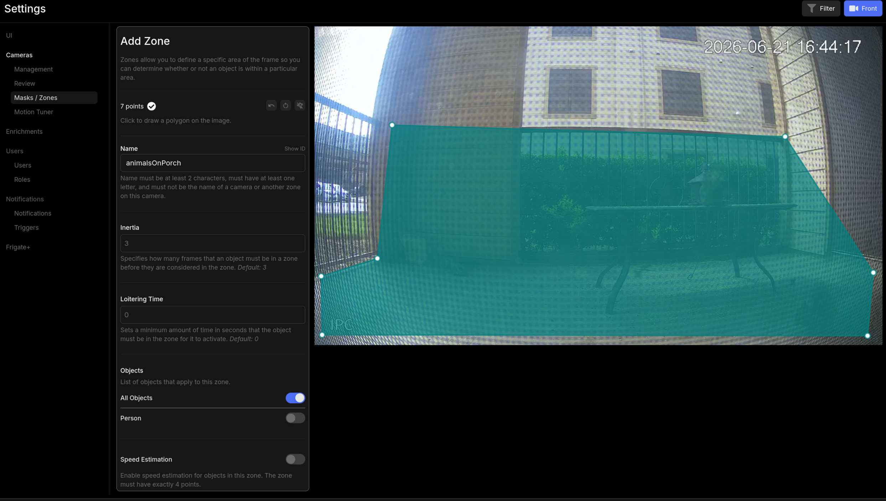
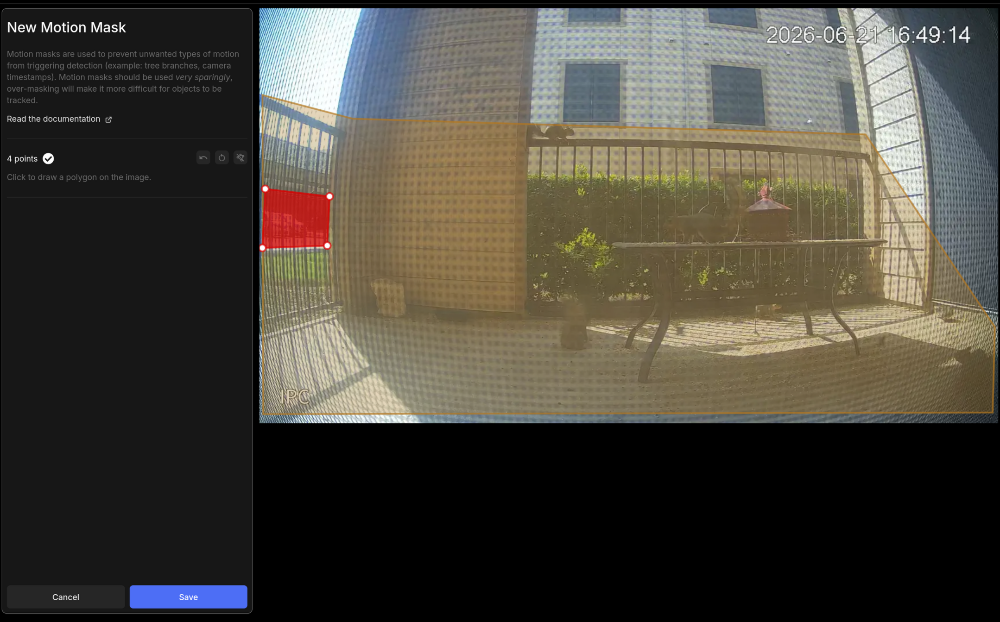
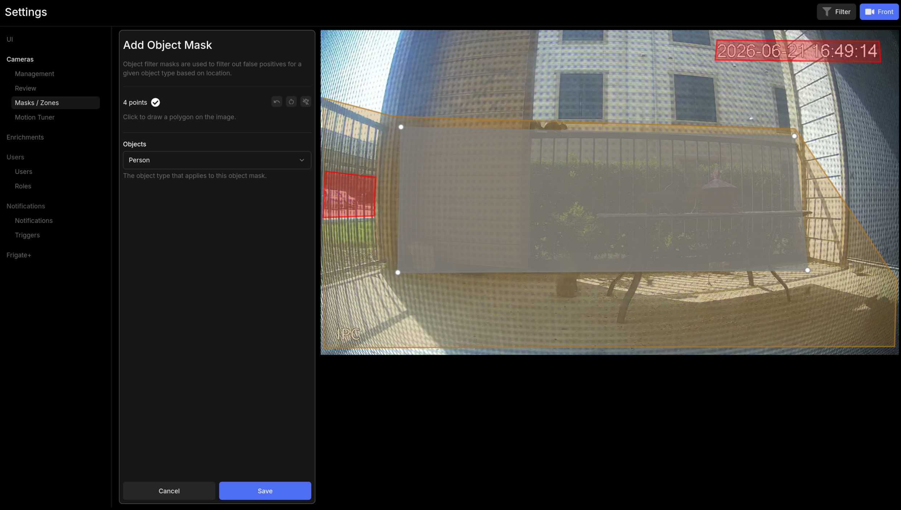

# Setting up recording zones and motion detection

By default, Frigate detects motion and objects across the entire frame of each camera. This works, but it also means events fire whenever a car passes on the street, a tree branch moves, or a bird crosses the field of view. Zones let you narrow detection to areas that matter, and motion masks let you tell Frigate to ignore areas that produce constant false triggers.

This guide covers both, along with how to control what gets recorded and when.

---

## Before you start

This guide assumes:

- Frigate is running and you have at least one camera with a working feed. See [Adding your first camera to Frigate](first-camera.md) if you haven't done that yet
- You can open the Frigate web interface at `https://frigate.internal` or your NVR's IP on port 5000
- You have SSH access to the NVR to edit `config.yml`

---

## Zones, motion masks, and object masks

Before touching any configuration, it helps to know what each concept does.

**Zones** define areas you care about. When a detected object, such as a person or vehicle, enters a zone, Frigate records the zone name in the event. You can filter notifications, recordings, and the event timeline by zone. Zones do not change what gets detected. Frigate still watches the full frame, but they let you answer the question "did something enter my driveway?" rather than "did something move anywhere in this camera's view?"

**Motion masks** tell Frigate to ignore motion in specific areas of the frame entirely. Use them for things that constantly trigger false motion: a flag blowing in the wind, a tree in the corner of the frame, a road where passing traffic creates non-stop alerts. Frigate won't process motion in a masked area, which reduces CPU load and eliminates events that don't matter.

**Object masks** tell Frigate to ignore a specific object type in an area of the frame, without suppressing all motion there. Use them when detection is working well overall but a particular class of object produces constant false positives — for example, a parked car that Frigate keeps re-detecting, or a neighbor's yard that always has people in it. Unlike motion masks, object masks are applied per object type.

Zones tell Frigate what to pay attention to. Masks tell Frigate what to ignore.

---

## Step 1 — Open the zone and mask editor

Navigate to **Settings → Masks/Zones**. The editor opens to the last active camera and shows the camera's live frame with a drawing tool. You'll click to place points that define the boundary of a zone or mask.

To switch cameras, click the button in the **top right of the UI** that shows the current camera's name. This opens a camera selector — pick the camera you want to configure before drawing anything.

---

## Step 2 — Draw a zone

1. In the zone editor, click **Add Zone**.
2. Click or tap points around the area you want to define as a zone. Each click places a corner of the polygon. Aim for a shape that covers the area without including unnecessary space. For a driveway, draw a polygon that follows the driveway edges. For an entry door, draw a tight rectangle in front of the door.
3. Give the zone a short, descriptive name. Use lowercase letters and underscores, since the name appears in your config file and in event details. Examples: `driveway`, `front_door`, `backyard`.
4. Click **Save** or **Apply**.

{ width="800" }

Frigate displays the zone as an overlay on the camera feed. You can draw multiple zones on the same camera.

After saving in the UI, Frigate generates the zone configuration. It will look like this in `config.yml`:

```yaml
cameras:
  front_door:
    zones:
      entry:
        coordinates: 0.1,0.9,0.45,0.9,0.45,0.5,0.1,0.5
```

The `coordinates` value is a series of x,y pairs expressed as fractions of the frame width and height, where `0,0` is the top-left corner and `1,1` is the bottom-right. The UI generates these for you, so you typically won't type them by hand.

---

## Step 3 — Enable alerts and detections for zones

Creating a zone doesn't automatically generate events or notifications — you need to enable those separately. Navigate to **Settings → Cameras → Review**.

To switch cameras, click the button in the **top right of the UI** that shows the current camera's name (same camera selector as the Masks/Zones screen). Make sure you're on the correct camera before making changes.

For each zone you created, you'll see toggles for **Alerts** and **Detections**:

- **Alerts** — triggers a notification when an object enters the zone. Use this for zones where you want active alerts, such as a front door or driveway.
- **Detections** — logs the event to the timeline and recordings without sending a notification. Use this for zones you want to review after the fact but don't need immediate alerts for.

A zone with neither toggle enabled will still appear as an overlay on the camera feed but won't produce events or notifications.

---

## Step 4 — Draw masks

Both mask types are drawn in **Settings → Masks/Zones** using the same drawing tool as zones. Use the top-right camera selector to switch cameras before drawing.

### Motion masks

Motion masks suppress all motion processing in an area. Use them for things that constantly trigger false motion: a flag blowing in the wind, a tree in the corner of the frame, a road where passing traffic creates non-stop alerts.

1. Click **Add Motion Mask** and draw a polygon over the area to exclude.
2. Save the mask.

{ width="800" }

The resulting config entry:

```yaml
cameras:
  front_door:
    motion:
      mask:
        - 0.0,0.0,0.3,0.0,0.3,0.25,0.0,0.25
```

Each item in the `mask` list is a polygon. You can add multiple masks to the same camera.

!!! note
    Motion masks reduce false triggers but don't affect object detection directly. A person who walks through a masked area can still be detected if the object detection model picks them up outside the mask boundary. Masks are most effective when the false trigger source, like a road or tree, is spatially distinct from the areas where you want real alerts.

### Object masks

Object masks suppress detections of a specific object type in an area, without suppressing all motion there. Use them when detection is working well overall but one object class keeps producing false positives in a particular spot — for example, a parked car Frigate keeps re-detecting, or an area that reliably produces unwanted `person` alerts.

1. Click **Add Object Mask** and draw a polygon over the area to filter.
2. Select the object type to suppress (for example, `car` or `person`).
3. Save the mask.

{ width="800" }

The resulting config entry:

```yaml
cameras:
  front_door:
    objects:
      filters:
        car:
          mask:
            - 0.6,0.4,1.0,0.4,1.0,0.8,0.6,0.8
```

Each object type gets its own `filters` entry. You can combine multiple object types and multiple polygons per type.

---

## Step 5 — Configure recording modes

Frigate supports several recording behaviors. You configure them per camera in `config.yml` under a `record` block.

### Continuous recording

Records all footage from the camera at all times, regardless of events. Highest storage use.

```yaml
cameras:
  front_door:
    record:
      enabled: true
      retain:
        days: 7
        mode: all
```

`mode: all` keeps all footage for the retention period. `mode: motion` keeps only segments that contain motion. `mode: active_objects` keeps only segments where a tracked object is present.

### Event-based recording

Records a clip around each detected event, plus a configurable buffer before and after.

```yaml
cameras:
  front_door:
    record:
      enabled: true
      events:
        retain:
          default: 14
          mode: active_objects
        pre_capture: 5
        post_capture: 5
```

`pre_capture` and `post_capture` are in seconds. This example keeps 5 seconds before the event starts and 5 seconds after it ends. `default: 14` retains event clips for 14 days.

### Recommended starting point

For most home setups, continuous recording with motion-based retention is a practical balance of storage use and coverage:

```yaml
cameras:
  front_door:
    record:
      enabled: true
      retain:
        days: 7
        mode: motion
      events:
        retain:
          default: 30
          mode: active_objects
        pre_capture: 5
        post_capture: 5
```

This keeps 7 days of motion segments for continuous playback and 30 days of event clips. Adjust the day counts to fit your storage capacity. See [Configuring recording retention policies](../storage/retention.md) for more detail on how retention interacts with storage.

---

## Step 6 — Apply the configuration and verify

After making changes in the UI or editing `config.yml` directly, restart Frigate to apply them:

```bash
docker restart frigate
```

Check the logs for any configuration errors:

```bash
docker logs frigate --tail 50
```

A misconfigured zone or mask shows up as a YAML parse error or a warning about an invalid coordinate. If the logs are clean, open the Frigate web interface.

To verify a zone is working:

1. Open the camera's live view.
2. Walk through the area covered by the zone.
3. Check the event timeline. Events that occurred within the zone will show the zone name in the event detail.

To verify a motion mask is working, watch the debug overlay on the camera feed. Motion detected in the masked area should not produce a motion indicator.

---

## What normal looks like

When zones and masks are configured correctly:

- Events on the timeline show zone names when the detected object was in a zone
- Motion from masked areas, such as a road or a tree, no longer produces constant motion events
- Recording segments accumulate at a rate consistent with your chosen retention mode

If events still fire for every car on the road after adding a mask, confirm the mask polygon covers the road fully and that Frigate was restarted after the change.

---

## Where to go from here

- [Tuning motion sensitivity to reduce false alerts](tuning-sensitivity.md), for adjusting detection thresholds beyond zones and masks
- [Filtering which events trigger notifications](../notifications/filtering.md), to control which zones and object types send alerts to your phone
- [Configuring recording retention policies](../storage/retention.md), to match storage use to available drive capacity
