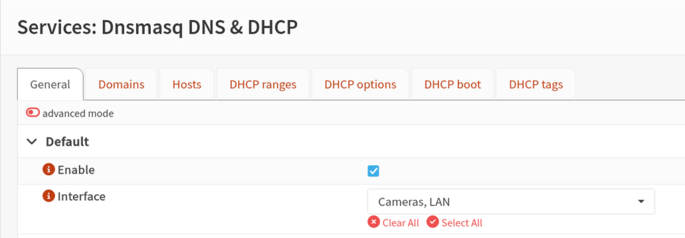
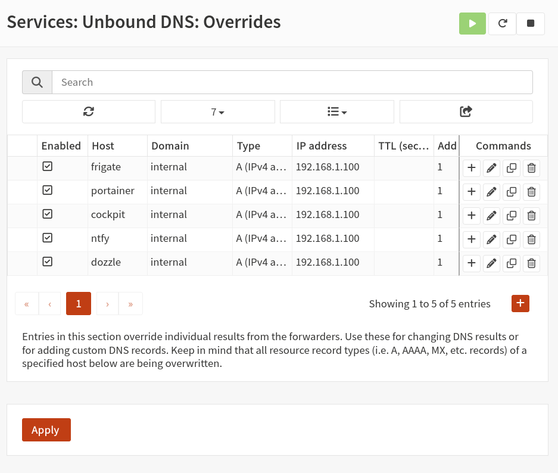

# Adding DNS entries in OPNsense for NVR services

If you're setting up Caddy as a reverse proxy on your NVR, you'll reach your services by hostname — `frigate.internal`, `portainer.internal`, `cockpit.internal`, `ntfy.internal`, and `dozzle.internal` — instead of remembering IP addresses and port numbers. Before any of that works, those hostnames need to resolve to your NVR's IP address on your network. This guide walks through adding those entries in OPNsense so every device on your LAN gets the right answer automatically, without editing a hosts file on each one.

You may be here as the next step in building out your stack, or because you already set up Caddy and a hostname won't load in your browser. Either way, the fix is the same.

---

## Before you start

This guide assumes:

- OPNsense is installed and running as your network router
- Your NVR has a static IP address on the main LAN, for example `192.168.1.100`. If not, complete the [static IP assignment](static-ip.md) guide first
- You have access to the OPNsense web interface

The [Caddy reverse proxy guide](caddy-reverse-proxy.md) points here because DNS should be in place before you test Caddy in a browser. You don't need Caddy running to complete the steps below. If Caddy isn't set up yet, finish here first and move on to that guide next.

Caddy routes traffic by hostname. Browsing to `https://192.168.1.100` won't land you on Frigate — Caddy needs to see `frigate.internal` in the request to know which service to forward to. Clean hostnames on standard ports 80 and 443 are the whole point of the reverse proxy setup.

---

## What DNS is doing here

When you type `frigate.internal` into your browser, your device asks a DNS server what IP address belongs to that name. If nothing on your network knows the answer, the request goes out to the public internet, which won't have an entry for your private NVR.

Public DNS servers like Google or Cloudflare resolve names on the internet. Local DNS resolves names that only exist on your home or business network. OPNsense runs **Unbound**, a local DNS resolver, and can answer for hostnames you define yourself.

Here's how the pieces fit together:

```
Your device  →  "What is frigate.internal?"  →  OPNsense (Unbound)
             ←  "192.168.1.100"           ←
Your device  →  HTTPS to 192.168.1.100, Host: frigate.internal
             →  Caddy reads the hostname and routes to Frigate
```

DNS gets the request to the right machine. Caddy gets it to the right service on that machine. Both have to agree on the hostname.

---

## The hostnames you'll be creating

These hostnames match the [Caddy reverse proxy guide](caddy-reverse-proxy.md) exactly:

| Service   | Hostname              | Points to                         |
|-----------|-----------------------|-----------------------------------|
| Frigate   | `frigate.internal`    | NVR static IP (e.g. `192.168.1.100`) |
| Portainer | `portainer.internal`  | NVR static IP                     |
| Cockpit   | `cockpit.internal`    | NVR static IP                     |
| ntfy      | `ntfy.internal`       | NVR static IP                     |
| Dozzle    | `dozzle.internal`     | NVR static IP                     |

All five entries point to the **same IP address**. That's expected. Caddy listens on that machine and uses the hostname in the request to decide which service to forward to.

---

## Why `.internal`?

`.internal` is reserved by ICANN specifically for private network use and will never be delegated as a public internet domain. That makes it the right choice for local DNS entries — it's guaranteed never to collide with a real website, and it's treated as ordinary DNS by every major platform: Windows, macOS, Linux, Android, and iOS all forward `.internal` queries to the configured DNS server without interception.

The common alternative, `.local`, is reserved for mDNS (Bonjour/Avahi) and causes resolution failures or multi-second delays on Windows, macOS, and Linux systems where mDNS intercepts the query before it reaches OPNsense. `.internal` avoids that entirely.

---

## Step 1 — Confirm OPNsense is your network's DNS server

Your devices need to ask OPNsense for DNS answers, otherwise the host overrides you create won't be used.

In the OPNsense web interface, navigate to **Services**, then **Dnsmasq DNS & DHCP**, then **General**. Confirm that your **LAN** interface is listed under the selected interfaces — this is what tells OPNsense to hand out its own address as the DNS server to devices on that network via DHCP.

{ width="800" }

If you have devices with manually configured static IP addresses, make sure their DNS server is set to your OPNsense LAN IP as well. They won't pick up DNS settings from DHCP automatically.

If you're running a separate DNS server on your network, such as Pi-hole, you'll need to add host overrides there instead of in OPNsense. This guide covers the OPNsense path specifically.

---

## Step 2 — Add host overrides in Unbound

Navigate to **Services**, then **Unbound DNS**, then **Overrides**, then **Host Overrides**.

You'll create five entries, one for each service hostname. For each entry, click **Add** and fill in the fields as shown below. Replace `192.168.1.100` with your NVR's actual static IP address.

**Frigate**

- **Host:** `frigate`
- **Domain:** `internal`
- **Type:** A (IPv4)
- **IP:** `192.168.1.100`
- **Description:** `Frigate via Caddy`

**Portainer**

- **Host:** `portainer`
- **Domain:** `internal`
- **Type:** A (IPv4)
- **IP:** `192.168.1.100`
- **Description:** `Portainer via Caddy`

**Cockpit**

- **Host:** `cockpit`
- **Domain:** `internal`
- **Type:** A (IPv4)
- **IP:** `192.168.1.100`
- **Description:** `Cockpit via Caddy`

**ntfy**

- **Host:** `ntfy`
- **Domain:** `internal`
- **Type:** A (IPv4)
- **IP:** `192.168.1.100`
- **Description:** `ntfy via Caddy`

**Dozzle**

- **Host:** `dozzle`
- **Domain:** `internal`
- **Type:** A (IPv4)
- **IP:** `192.168.1.100`
- **Description:** `Dozzle via Caddy`

OPNsense combines the Host and Domain fields into the full hostname, so `frigate` plus `internal` becomes `frigate.internal`. Don't put the full hostname in the Host field.

All five entries use the same IP address. That's not a mistake — Caddy handles routing from there.

Click **Save**, then **Apply changes**.

{ width="800" }

---

## Step 3 — Verify Unbound is resolving your entries

Before testing from another device, confirm OPNsense itself is returning the right answers.

Navigate to **Services**, then **Unbound DNS**, then **Diagnostics**. Use the lookup tool to query each hostname:

- `frigate.internal`
- `portainer.internal`
- `cockpit.internal`
- `ntfy.internal`
- `dozzle.internal`

Each query should return your NVR's static IP address.

If a lookup fails, double-check the Host and Domain fields in your overrides for typos. Also confirm Unbound is enabled under **Services**, then **Unbound DNS**, then **General**.

---

## Step 4 — Verify from a device on your network

Test from a computer or phone connected to your main LAN.

**Check name resolution**

On Linux or Mac:

```bash
ping frigate.internal
```

On Windows:

```powershell
ping frigate.internal
```

The ping itself may or may not get a response depending on your firewall rules. What matters is that the hostname resolves to your NVR's IP address before the ping attempt starts.

For a more explicit check, run:

```bash
nslookup frigate.internal
```

The server in the response should be your OPNsense LAN IP. The address returned should be your NVR's static IP. Repeat for all five hostnames.

**Test in a browser (requires Caddy to be running)**

If you've already completed the [Caddy reverse proxy guide](caddy-reverse-proxy.md), open a browser and navigate to each hostname:

- `https://frigate.internal`
- `https://portainer.internal`
- `https://cockpit.internal`
- `https://ntfy.internal`
- `https://dozzle.internal`

You'll likely see a certificate warning the first time you visit each one. That's expected and covered in the Caddy guide. The page loading at all confirms DNS is working.

If Caddy isn't set up yet, you're done here. Move on to the Caddy guide next.

**If something still isn't working**

- The name resolves to the wrong address: the device may be using a different DNS server than OPNsense. Check its network settings or DHCP lease.
- The name doesn't resolve at all: try disconnecting and reconnecting to your network to refresh DNS. On Android, check whether Private DNS is enabled.
- The name resolves on one device but not another: see [Can't reach a service by hostname](../troubleshooting/hostname.md), especially the [Windows DNS troubleshooting](../troubleshooting/hostname.md#windows-dns-troubleshooting) section if the failing device is a Windows PC.
- The name resolves but the page won't load: that's a Caddy or container issue, not DNS. See [Can't reach a service by hostname](../troubleshooting/hostname.md) or the troubleshooting section in the [Caddy guide](caddy-reverse-proxy.md).

---

## Camera VLAN DNS

If you've set up a camera VLAN following the [OPNsense VLAN guide](vlan-opnsense.md), your cameras only need to reach the NVR by IP address. They don't need to resolve `frigate.internal` or the other service hostnames, and no separate DNS configuration is required on the camera VLAN for a standard LAN Foundry setup.

Devices on your main LAN will pick up these DNS entries automatically through DHCP as long as OPNsense is their DNS server.

---

## Where to go from here

With DNS entries in place, your network knows where to find the NVR when you use a service hostname.

**Next in the stack**

- [Configuring Caddy as a reverse proxy](caddy-reverse-proxy.md) — if you haven't set it up yet, this is the next guide
- [Adding your first camera to Frigate](../cameras/first-camera.md) — once Caddy is running and your services are reachable

**Network hardening (if not done yet)**

- [Understanding network segmentation and VLANs](../privacy/blocking-telemetry.md)
- [Setting up a camera VLAN in OPNsense](vlan-opnsense.md)
