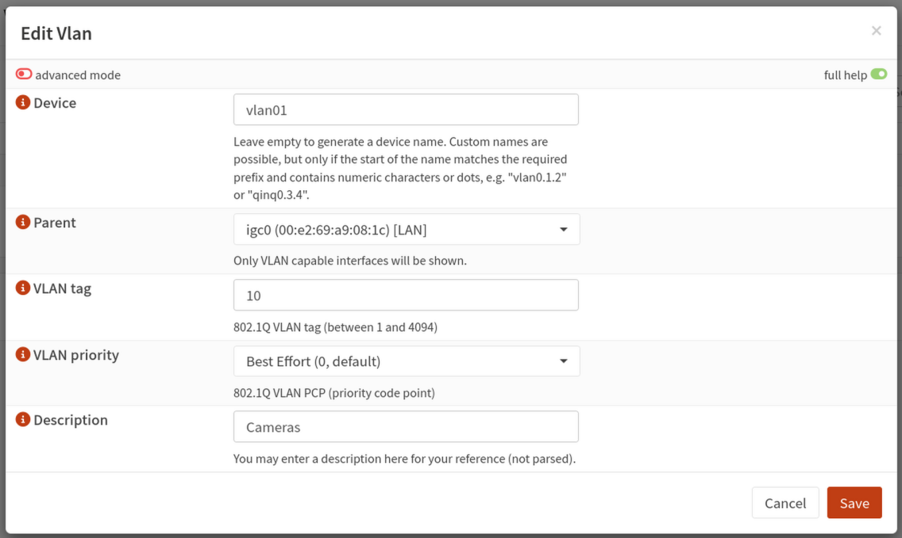
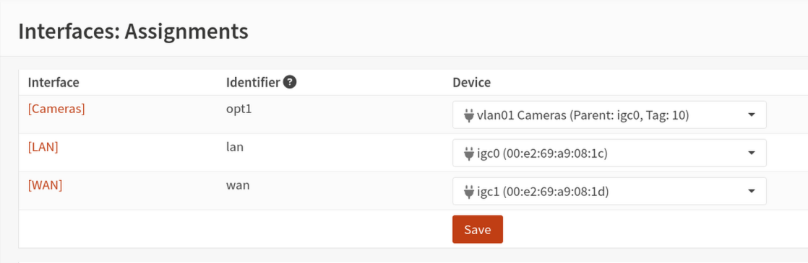
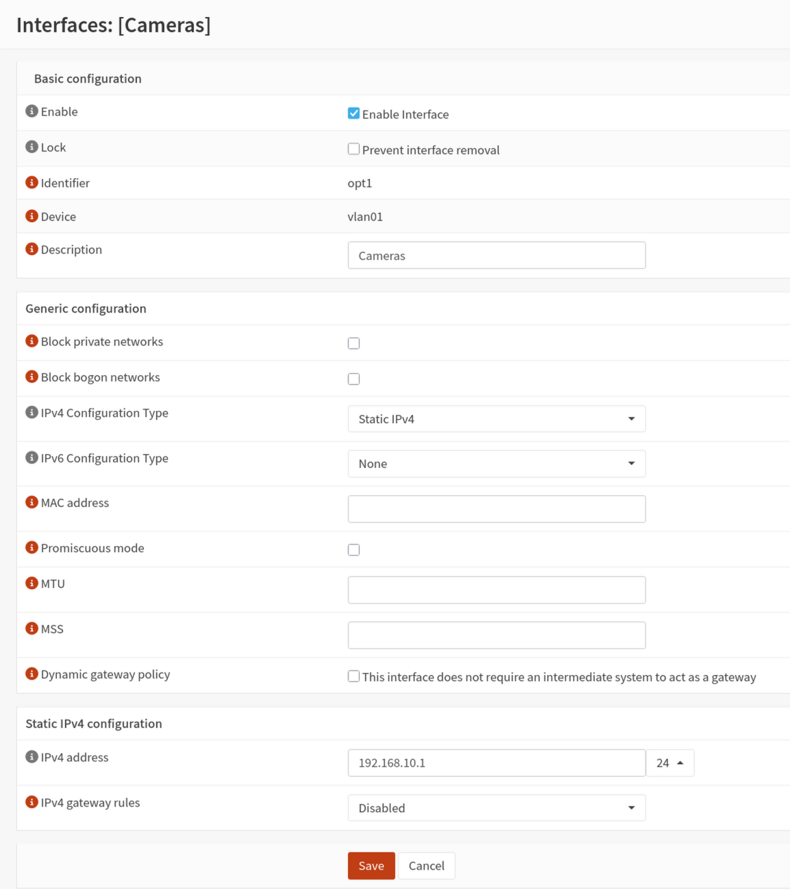
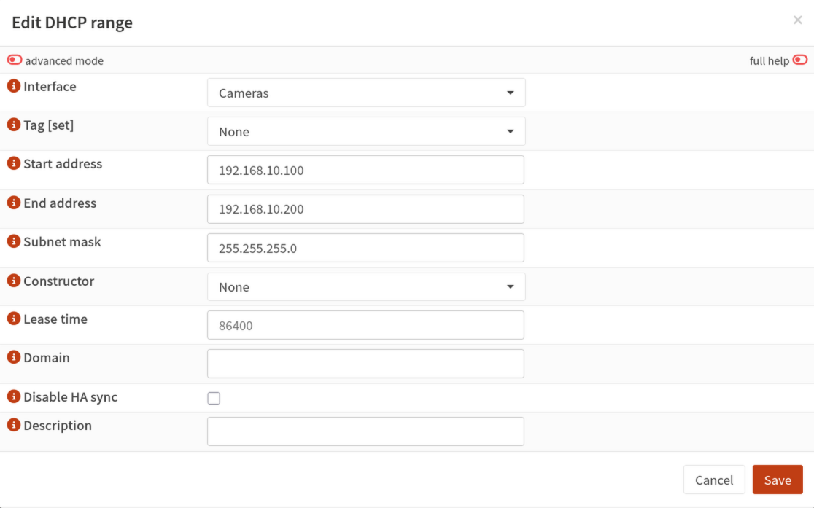
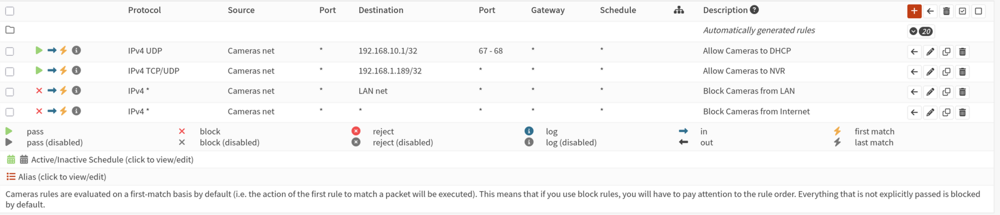
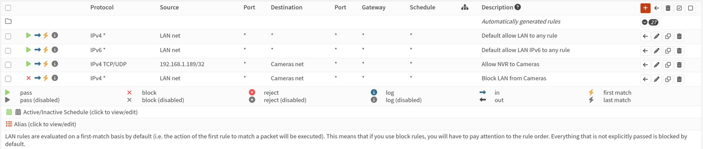
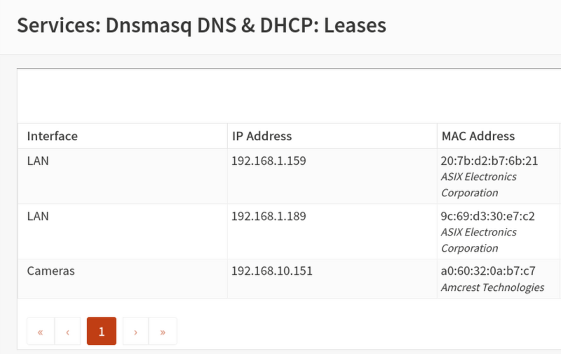

# Setting up a camera VLAN in OPNsense

This guide walks through creating a dedicated VLAN for your security cameras in OPNsense, configuring DHCP so cameras get IP addresses automatically, and setting up firewall rules so cameras can only communicate with your NVR. Nothing else on your network will be able to reach your cameras directly, and your cameras won't be able to reach the internet or any other network segment.

If you haven't read the [network segmentation and VLANs](../privacy/blocking-telemetry.md) guide yet, start there. It explains what a VLAN is and why you want one before walking through the configuration steps here.

---

## Before you start

This guide assumes:

- OPNsense is installed and running with at least two physical interfaces, one for WAN and one for LAN
- Your LAN interface is connected to a managed switch via a trunk port, meaning the switch carries traffic for multiple VLANs over a single cable from the router
- Your NVR has a static IP address on the main LAN. If not, complete the [static IP assignment](static-ip.md) guide first
- You have access to the OPNsense web interface

---

## A quick note on subnet notation

Throughout this guide you'll see IP addresses written with a slash and a number, like `192.168.10.0/24`. This is called CIDR notation and it describes both the network address and how many devices it can hold.

The number after the slash is the prefix length. A **/24** means the first 24 bits of the address define the network, leaving 8 bits for device addresses. In practical terms, a /24 gives you 254 usable IP addresses, `192.168.10.1` through `192.168.10.254`. This is the most common subnet size for a home or small business network and is what this guide uses for the camera VLAN.

You'll also see **/32** appear later in the firewall rules section. A /32 refers to a single specific IP address rather than a range. When you write a firewall rule targeting your NVR's specific IP, OPNsense uses /32 notation to indicate that exact address and nothing else.

---

## Step 1 — Choose a VLAN ID

A VLAN ID is a number that identifies your virtual network. Valid VLAN IDs range from 1 to 4094. A few things to keep in mind when choosing one:

- VLAN 1 is the default untagged VLAN on most switches and should be left alone
- VLAN 4094 is reserved on some platforms
- The usable range for custom VLANs is effectively 2 to 4093
- Choose a number that isn't already in use on your network

This guide uses **VLAN 10** as the camera VLAN ID. You can use any available number, just be consistent and use the same ID in OPNsense and on your switch.

---

## Step 2 — Create the VLAN in OPNsense

In the OPNsense web interface, navigate to **Interfaces**, then **Other Types**, then **VLAN**.

Click **Add** to create a new VLAN and fill in the following:

- **Parent interface:** select your LAN interface, typically `igb1` or `em1` depending on your hardware. This is the physical port connected to your managed switch
- **VLAN tag:** enter your chosen VLAN ID, for example `10`
- **VLAN priority:** leave this at the default
- **Description:** something descriptive like `Cameras`

Click **Save**, then click **Apply changes**.

{ width="700" }

---

## Step 3 — Assign the VLAN as an interface

Creating the VLAN makes it exist, but OPNsense needs it assigned as a named interface before you can configure it. Navigate to **Interfaces**, then **Assignments**.

At the bottom of the assignments list you'll see a dropdown for adding a new interface. Select your newly created VLAN from the dropdown, it will appear as something like `vlan0.10`, and click **Add**.

{ width="700" }

Click the name of the newly assigned interface to configure it:

- **Enable:** check this box
- **Description:** `CAMERAS` or similar. This becomes the interface name used throughout OPNsense
- **IPv4 configuration type:** Static IPv4
- **IPv4 address:** `192.168.10.1` with a prefix of `/24`

This assigns `192.168.10.1` as the OPNsense gateway address for the camera VLAN. Devices on this VLAN will use this address as their default gateway.

Click **Save**, then **Apply changes**.

{ width="700" }

---

## Step 4 — Set up DHCP for the camera VLAN

With the interface configured, you can set up DHCP so cameras automatically receive IP addresses when they connect. Navigate to **Services**, then **Dnsmasq DNS & DHCP**.

### Enable the service and select the interface

On the **General** tab, confirm the **Enable** checkbox is checked. Directly below it is an **Interface** multi-select — add your camera VLAN interface here alongside any other interfaces already listed. This is the step that activates DHCP for the camera VLAN; without it the service runs but ignores requests arriving on that interface.

Click **Save**.

{ width="700" }

### Configure the DHCP range

Click the **DHCP ranges** tab and add a new entry for the camera VLAN:

- **Interface:** select your camera VLAN interface
- **Start address:** `192.168.10.100`
- **End address:** `192.168.10.200`
- **Subnet mask:** `255.255.255.0`

Leave the remaining fields at their defaults unless you have a specific reason to change them.

Click **Save**.

{ width="700" }

When a camera connects to a switch port assigned to VLAN 10, it will automatically receive an IP address in the range you defined.

---

## Step 5 — Create firewall rules

Firewall rules control what traffic is allowed to flow between your camera VLAN and the rest of your network. You'll create six rules across two interfaces.

A note on how OPNsense evaluates rules: rules are processed top to bottom and the first matching rule wins. Allow rules must always appear above block rules on the same interface, otherwise traffic gets blocked before the allow rule is ever checked.

### Camera VLAN interface rules

These rules control what your cameras can send out. Navigate to **Firewall**, then **Rules**, then select your camera VLAN interface.

**Rule 1 — Allow cameras to reach the DHCP server**

Cameras need to request an IP address via DHCP when they first connect. DHCP requests are sent to OPNsense on UDP port 67. Without this rule, the block rules below drop those requests and cameras won't receive addresses.

Click **Add** and configure as follows:

- **Action:** Pass
- **Interface:** your camera VLAN interface
- **Direction:** in
- **Protocol:** UDP
- **Source:** camera VLAN net
- **Destination:** `192.168.10.1/32` (the camera VLAN gateway address you assigned in Step 3)
- **Destination port range:** 67 (bootps)
- **Description:** Allow cameras to DHCP server

Click **Save**.

**Rule 2 — Allow cameras to reach the NVR**

Click **Add** and configure as follows:

- **Action:** Pass
- **Interface:** your camera VLAN interface
- **Direction:** in
- **Protocol:** TCP/UDP
- **Source:** camera VLAN net
- **Destination:** your NVR's static IP address. Enter it as `192.168.1.100/32`, the /32 means this rule applies to that single specific address and nothing else
- **Destination port range:** create a port alias or enter the following ports individually: 554, 8554, 80, 443, 3702
- **Description:** Allow cameras to NVR

Click **Save**.

**Rule 3 — Block cameras from reaching the LAN**

Click **Add** and configure as follows:

- **Action:** Block
- **Interface:** your camera VLAN interface
- **Direction:** in
- **Protocol:** any
- **Source:** camera VLAN net
- **Destination:** LAN net
- **Description:** Block cameras from LAN

Click **Save**.

**Rule 4 — Block cameras from reaching the internet**

Click **Add** and configure as follows:

- **Action:** Block
- **Interface:** your camera VLAN interface
- **Direction:** in
- **Protocol:** any
- **Source:** camera VLAN net
- **Destination:** any
- **Description:** Block cameras from internet

Click **Save**, then **Apply changes**.

<figure markdown>
  { width="900" }
  <figcaption>All four camera VLAN rules in order. The two pass rules must sit above the two block rules or cameras will be unable to get DHCP leases or reach the NVR.</figcaption>
</figure>

### LAN interface rules

These rules control what can reach your cameras from the main network. Navigate to **Firewall**, then **Rules**, then select your LAN interface.

**Rule 5 — Allow the NVR to reach cameras**

Click **Add** and configure as follows:

- **Action:** Pass
- **Interface:** LAN
- **Direction:** in
- **Protocol:** TCP/UDP
- **Source:** your NVR's static IP address, entered as `192.168.1.100/32`
- **Destination:** camera VLAN net
- **Destination port range:** same ports as Rule 2, 554, 8554, 80, 443, 3702
- **Description:** Allow NVR to cameras

Click **Save**.

**Rule 6 — Block everything else from reaching the camera VLAN**

Click **Add** and configure as follows:

- **Action:** Block
- **Interface:** LAN
- **Direction:** in
- **Protocol:** any
- **Source:** any
- **Destination:** camera VLAN net
- **Description:** Block LAN from cameras

Click **Save**, then **Apply changes**.

<figure markdown>
  { width="900" }
  <figcaption>The NVR allow rule must appear above the block rule. OPNsense also adds default LAN allow rules at the top — your two rules sit below those.</figcaption>
</figure>

---

## Step 6 — Verify the configuration

With the VLAN, DHCP, and firewall rules in place, connect a camera to a switch port assigned to VLAN 10 and verify the following:

**Camera receives an IP address**
Check your camera's network settings or look in OPNsense under **Services**, then **Dnsmasq DNS & DHCP**, then **Leases** to see if the camera has received an address in your defined range.

{ width="700" }

**Camera is reachable from the NVR**
From the NVR, try to ping the camera's assigned IP address:

```bash
ping -c 3 192.168.10.x
```

This should succeed since the NVR is allowed to reach cameras by Rule 5.

**Camera is not reachable from other devices**
From a device on your main LAN that is not the NVR, try to browse to the camera's IP address in a browser. The connection should time out. If it does, Rule 6 is working correctly.

**Camera cannot reach the internet**
In OPNsense, navigate to **Firewall**, then **Log Files**, then **Live View** and filter for your camera VLAN interface. Watch for blocked outbound entries from camera IP addresses to external destinations. These confirm that Rule 4 is catching phone-home attempts.

---

## Where to go from here

With your camera VLAN configured in OPNsense, the next step is configuring your managed switch so camera ports are assigned to VLAN 10 and the uplink to your router carries the VLAN tag correctly. The [TP-Link TL-SG switch guide](vlan-tplink.md) covers this for the switches included in the Argus lineup. If you're using a different managed switch, see the [switch configuration section](vlan-other-routers.md#part-2-switch-configuration) of the other routers and switches guide.
