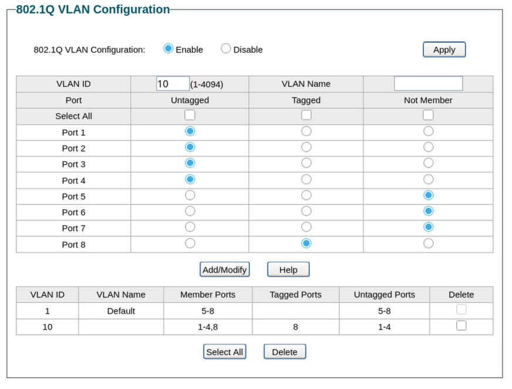
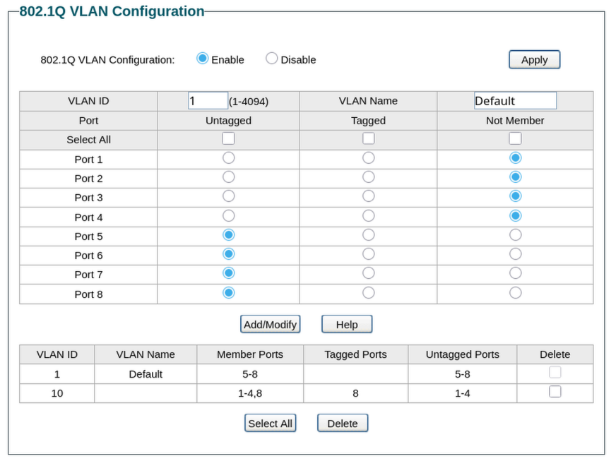
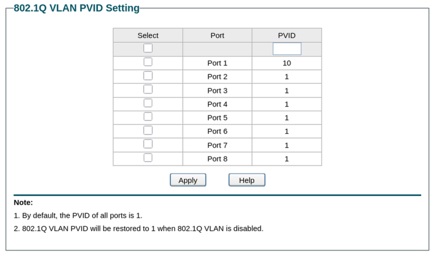

# Setting up a camera VLAN on TP-Link TL-SG switches

This guide walks through configuring 802.1Q VLAN on the TP-Link TL-SG108PE, TL-SG1210MPE, and TL-SG1218MP switches. These are the managed switches included in the Argus Vigil, Sentinel, and Warden respectively. All three share the same Easy Smart web interface so the steps are identical regardless of which model you have.

This guide covers the switch side of VLAN configuration only. Your router needs to have the camera VLAN created and configured before the switch configuration will work. If you haven't done that yet, complete the [OPNsense VLAN guide](vlan-opnsense.md) or the [general router VLAN guide](vlan-other-routers.md) first.

---

## Before you start

You'll need:

- A computer connected to the switch on the same network
- The switch's IP address. By default TP-Link Easy Smart switches use `192.168.0.1`. If your network uses a different subnet, check your router's DHCP leases to find the switch's assigned address
- The VLAN ID you created on your router. This guide uses VLAN 10 as the example, use whatever ID you chose
- A plan for which ports will be used for cameras and which port will connect to your router

**A note on port planning before you start:**

Take a moment to decide which ports you'll use before touching the web interface. You'll need:

- One non-PoE port for the uplink to your router. Using a non-PoE port for the uplink keeps all PoE ports free for cameras. Choosing a port at the physical edge of the switch makes it easy to remember and identify
- One or more ports for each camera. Any PoE port works. Cameras will be powered directly through the ethernet cable, no separate power supply needed
- Any remaining ports will stay on the default VLAN for main LAN devices if needed

Write down your port assignments before proceeding. You'll be referencing them throughout the configuration.

---

## Step 1 — Access the switch web interface

Open a browser and navigate to the switch's IP address. The default is `192.168.0.1`. Log in with the admin credentials. The default username and password are both `admin` unless you've changed them.

If you can't reach the switch at the default IP, it may have received an address from your router's DHCP server. Check your router's DHCP lease table to find the assigned address.

---

## Step 2 — Enable 802.1Q VLAN

Navigate to **VLAN**, then **802.1Q VLAN**.

At the top of the page you'll see a toggle or dropdown to enable 802.1Q VLAN configuration. Select **Enable** and click **Apply**.

This enables the 802.1Q VLAN mode on the switch. Note that the switch operates in one VLAN mode at a time. Enabling 802.1Q will disable any port-based VLAN configuration that was previously set.

---

## Step 3 — Create the camera VLAN

Still on the **VLAN > 802.1Q VLAN** page, you'll now see fields to create a new VLAN.

Enter the following:

- **VLAN ID:** `10` or whatever ID you used on your router
- **VLAN Name:** `Cameras` or similar for easy identification

Now configure the port membership for this VLAN. Each port has three options:

- **Untagged** — the port is a member of this VLAN and strips the VLAN tag before sending traffic to the device. Use this for camera ports. Cameras don't understand VLAN tags and expect plain untagged traffic
- **Tagged** — the port is a member of this VLAN and keeps the VLAN tag on outgoing traffic. Use this for the uplink port to your router. The router needs to see the VLAN tag to know which VLAN the traffic belongs to
- **Not Member** — the port is excluded from this VLAN entirely

Configure the ports as follows:

- Set your uplink port to **Tagged**
- Set each camera port to **Untagged**
- Leave all other ports as **Not Member**

Click **Add/Modify** to save the VLAN.

<figure markdown>
  { width="800" }
  <figcaption>VLAN 10 configuration with camera ports (1–4) set to Untagged and the uplink port (8) set to Tagged. Remaining ports are Not Member. The summary table at the bottom confirms the membership.</figcaption>
</figure>

---

## Step 4 — Verify VLAN 1 port membership

VLAN 1 is the default VLAN that carries your main LAN traffic. You need to confirm that port membership for VLAN 1 is set correctly so that management traffic and main LAN traffic continue to flow while camera ports are fully excluded.

Select **VLAN 1** from the VLAN table and verify the following:

- **Uplink port:** set to **Untagged**. VLAN 1 is the native VLAN on this switch, so the uplink carries VLAN 1 traffic untagged. Do not set it to Tagged — that will break your connection to the router
- **Main LAN device ports:** set to **Untagged**
- **Camera ports:** set to **Not Member**. Camera ports must be excluded from VLAN 1 entirely or cameras may receive addresses from the wrong subnet

Click **Add/Modify** if you need to make any changes.

<figure markdown>
  { width="800" }
  <figcaption>VLAN 1 (Default) with LAN ports (5–8) set to Untagged and camera ports (1–4) set to Not Member. The uplink (port 8) is Untagged here — not Tagged — because VLAN 1 is the native VLAN.</figcaption>
</figure>

---

## Step 5 — Set the PVID for each port

PVID stands for Port VLAN ID. It tells the switch which VLAN to assign incoming untagged traffic to on each port. This is what determines which VLAN a device ends up on when it connects.

Navigate to **VLAN**, then **802.1Q PVID Setting**.

Configure the PVIDs as follows:

- **Uplink port:** PVID `1`. Traffic from the router arrives tagged so the PVID doesn't affect it, but setting it to 1 keeps the default consistent
- **Camera ports:** PVID `10`. Untagged traffic arriving from cameras gets assigned to VLAN 10
- **Main LAN ports:** PVID `1`. Untagged traffic from other devices stays on the main LAN

Select each port or group of ports, enter the appropriate PVID, and click **Apply**. Repeat for each group.

{ width="600" }

---

## Step 6 — Save the configuration

TP-Link Easy Smart switches apply changes immediately but some firmware versions require you to explicitly save to ensure the configuration persists after a reboot. Look for a **Save** option in the top navigation or under the **System** menu and save the current configuration.

---

## Step 7 — Verify the setup

Connect a camera to one of the ports you assigned to the camera VLAN and verify the following:

**Camera receives an IP address from the camera subnet**
Check your router's DHCP lease table. The camera should receive an address in the `192.168.10.x` range you configured for the camera VLAN. If it receives a `192.168.1.x` address instead, the PVID on that port is likely still set to 1 rather than 10.

**Camera is reachable from the NVR**
From the NVR, ping the camera's assigned IP address:

```bash
ping -c 3 192.168.10.x
```

If this succeeds, traffic is flowing correctly between the NVR on the main LAN and the camera on the camera VLAN through your router's firewall rules.

**Camera is not reachable from other devices**
From a device on your main LAN that is not the NVR, try to browse to the camera's IP address. The connection should time out, confirming the firewall rules are blocking unauthorized access to the camera VLAN.

---

## A note on PoE

All three switches in the Argus lineup are PoE capable. Any camera connected to a PoE port will be powered directly through the ethernet cable. No separate power supply or power adapter is needed at the camera. The switch handles power delivery automatically when it detects a PoE-compatible device.

PoE ports can also connect to non-PoE devices without any issues. The switch will not attempt to supply power to a device that doesn't request it.

---

## Where to go from here

With the switch configured, your camera VLAN is fully operational end to end. Cameras on the designated ports will receive IP addresses from the camera subnet, connect to your NVR, and be isolated from the rest of your network.

If you're using a different managed switch, the [switch configuration section](vlan-other-routers.md#part-2-switch-configuration) of the other routers and switches guide covers the same concepts for other hardware. If your switch configuration is complete and you're ready to start adding cameras to Frigate, head to the [adding your first camera](../cameras/first-camera.md) guide.
